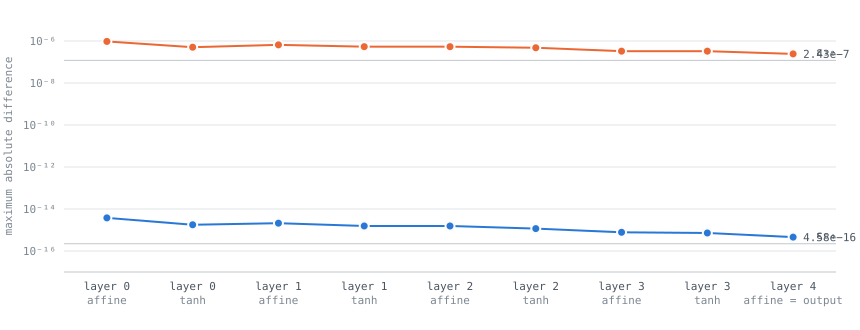
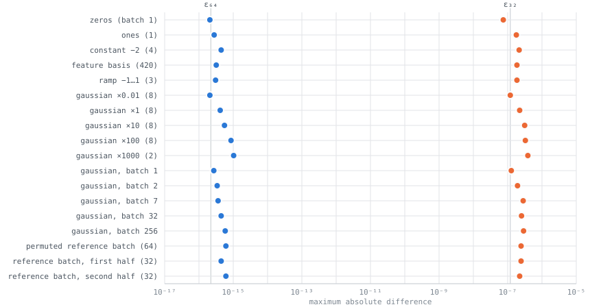
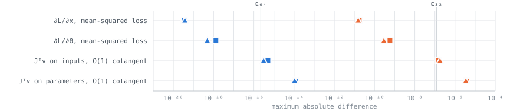
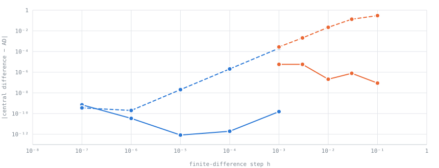
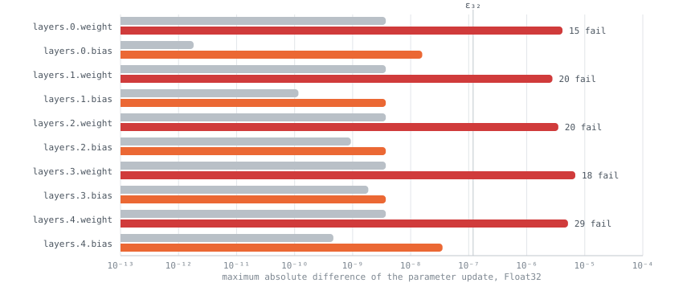
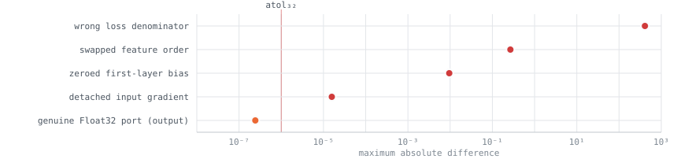
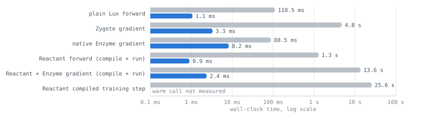

# Figures: column MLP acceptance run, 10 September 2026

Seven figures drawn from the committed reports in this directory. Every point
is a maximum absolute difference between the Lux implementation and the
PyTorch reference on identical arrays, for the full paper-size model
(420 → 512 → 512 → 512 → 512 → 412, tanh, 1,214,876 parameters, batch 64).
Machine epsilon for each precision (ε₆₄ = 2.2e-16, ε₃₂ = 1.2e-7) is drawn as a
reference line. The interactive version with hover values and data tables is
[figures.html](figures.html)
(served at <https://glwagner.github.io/Torchlight.jl/results/2026-09-10/figures.html>
once GitHub Pages has built).

Blue is Float64, orange is Float32, red marks a failing check.

## 1. Layer by layer, the forward pass sits at the precision floor

Errors are a few ε and shrink through the tanh layers rather than grow. The
first affine layer, with the largest inner dimension, carries the largest
rounding. The last point is the model output.

## 2. Agreement holds across the declared input domain, not just one batch

All 18 input families exported by the PyTorch side: sentinels, Gaussian inputs
from ×0.01 to ×1000, batch sizes 1 to 256, and permuted or split reference
batches. Inputs a thousand times larger than the training scale saturate every
tanh and still agree to a few ε. Batch size does not move the error, which is
the column-independence property a parameterization needs.

## 3. Three Julia AD paths give the same derivatives as PyTorch autograd

Circles are Zygote, squares native Enzyme, triangles Reactant + Enzyme. The
three markers for each quantity overlap: Zygote and Enzyme are bit-identical on
these kernels and the compiled Reactant path lands within one rounding of them.
Gradients of the mean-squared loss are small numbers, so their absolute errors
sit far below ε; the VJPs with an O(1) cotangent show the honest scale.

## 4. Finite differences converge to the analytic derivative, then roundoff takes over

Solid lines are the input direction, dashed the parameter direction. The V
shape is the signature of a correct derivative: truncation error falls as h²
on the right, roundoff rises on the left, and the minimum is where a wrong
gradient could not hide. Float32 needs steps a thousand times larger and
bottoms out a million times higher.

## 5. One optimizer step matches, except where Float32 Adam divides by nearly zero

Gray is the SGD update, orange the Adam update, red an Adam block with
components failing the frozen tolerance (count printed). SGD updates agree to
one Float32 ulp of the weights. Adam's first step is lr·g/(|g|+ε) with
ε = 1e-8, so wherever |g| is within a thousand ε the smallest rounding of g
moves the update at order one. All 102 failing components are of that kind,
and feeding PyTorch's exact gradients into `Optimisers.Adam` reproduces its
update to 3.7e-9. In Float64 the same step passes at 1.7e-14. The run is
recorded as not accepted rather than the bar being loosened.

## 6. Injected mistakes land orders of magnitude above the bar

A wrong loss denominator, swapped feature order, a zeroed bias, and a detached
input gradient are each separated from a genuine Float32 port by four to eight
decades. A fifth defect, an incomplete parameter mapping, raises before any
number is computed.

## 7. Compilation is the cost; execution is not

Full model, Float64, CPU. Reactant spends 13 seconds compiling the gradient
and then evaluates it in 2 milliseconds; the compiled training step pays
26 seconds once. Host-transfer synchronization is inside every Reactant timing.

## How the figures were made

The SVGs are the charts of `figures.html`, which reads the metrics embedded
from `column_mlp_full_float64.json` and `column_mlp_full_float32.json`, rendered
once with the light palette. Regenerate by editing the JSON block at the top of
the page's script.
